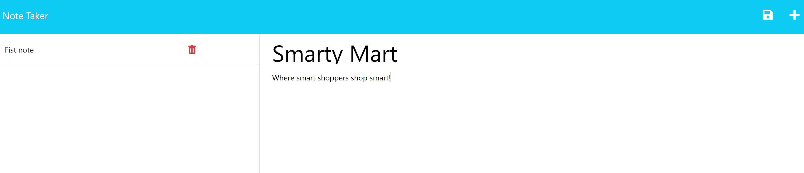

# Note-Taker

## Description/Link
User can write, save, and delete notes.

## Table of Contents
- [Installation](#installation)
- [Usage](#usage)
- [Contributing](#contributing)
- [Contact](#contact)

## Installation
Download code from the GitHub repository. Have Node.js installed. Link to Node.js downloads: https://nodejs.dev/en/download/. In a terminal input npm init -y. Then in the terminal install express and uuid by inputting npm install.

## Usage
User can enter a title and the note below. Then it the save button in the top right corner. It will then show on the left side of the site. The user can click on it to view an old note and it will appear on the right screen. If the user wants to make a new note, but is still in an old note they can click on the + symbol to clear the old note.

## Contributing
Author: Xandromus from the Rice Coding Bootcamp

April, 2020

Source code: HTML, CSS, and JavaScript
https://github.com/coding-boot-camp/miniature-eureka

Packages used:
 Express: https://www.npmjs.com/package/express
 UUID: https://www.npmjs.com/package/uuid

## Contact
GitHub profile: https://github.com/CYMcolor